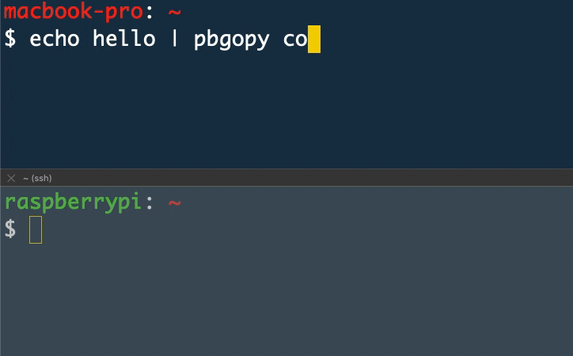

# pbgopy
[](https://github.com/nakabonne/pbgopy/releases/latest)
[](https://pkg.go.dev/mod/github.com/nakabonne/pbgopy?tab=packages)

`pbgopy` acts like [pbcopy/pbpaste](https://www.unix.com/man-page/osx/1/pbcopy/) but for multiple devices. It lets you share data across devices like you copy and paste.



## Installation
Binary releases are available through [here](https://github.com/nakabonne/pbgopy/releases).

#### MacOS

```
brew install nakabonne/pbgopy/pbgopy
```

#### RHEL/CentOS

```
rpm -ivh https://github.com/nakabonne/pbgopy/releases/download/v0.1.0/pbgopy_0.1.0_linux_amd64.rpm
```

#### Debian/Ubuntu

```
wget https://github.com/nakabonne/pbgopy/releases/download/v0.1.0/pbgopy_0.1.0_linux_amd64.deb
apt install ./pbgopy_0.1.0_linux_amd64.deb
```

#### Go

```
go get github.com/nakabonne/pbgopy
```

#### Docker

```
docker run --rm nakabonne/pbgopy pbgopy help
```

## Usage
First up, you start the pbgopy server which works as a shared clipboard for devices. It listens on port 9090 by default.
You must allow access to this port for each device you want to share data with.

```bash
pbgopy serve
```

Put the address of the host where the `pbgopy serve` process is running into `PBGOPY_SERVER` environment variable.

```bash
export PBGOPY_SERVER=http://host.xz:9090
pbgopy copy <foo.png
```

Then paste it on another device:

```bash
export PBGOPY_SERVER=http://host.xz:9090
pbgopy paste >foo.png
```

### TTL
You can set TTL for the cache. Give `0s` for disabling it. Default is `24h`.

```bash
pbgopy serve --ttl 10m
```

### End-to-end encryption
`pbgopy` comes with an ability to encrypt/decrypt with a common key, hence allows you to perform end-to-end encryption without working with external tools.

```bash
pbgopy copy -k 32-byte-or-less-string <secret.txt
```

Then decrypt with the same key:

```bash
pbgopy paste -k 32-byte-or-less-string
```

## Inspired By
- [nwtgck/piping-server](https://github.com/nwtgck/piping-server)
- [bradwood/glsnip](https://github.com/bradwood/glsnip)
